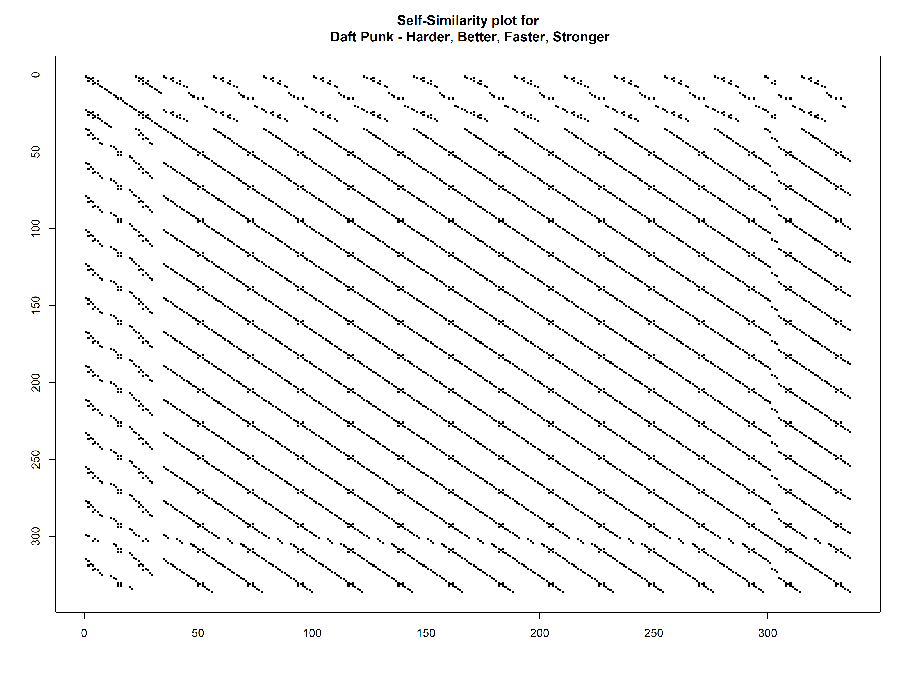

# Self-Similarity plots using song lyrics
This project creates self-similarity plots (also known as "recurrence plots") from song lyrics. I'm using R to replicate Colin Morris' work at [SongSim](https://colinmorris.github.io/SongSim/#/about) which was featured on Vox's "Earworm" series, episode 5, titled: ["Why we really really really like repetition in music"](https://www.youtube.com/watch?v=HzzmqUoQobc). 

## Before running the file

You'll need
1. R, with the "here" package installed
2. A text file containing the lyrics (*must have an empty line at start and end of the file*)

## To generate the plot
1. Open the R script, `01_self_sim_plot` and add the artist and song name, e.g., "Artist - Song"
2. Choose the appropriate text file with the lyrics you want to plot when prompted at the start of the R script. 
3. Run the rest of the script. The plot will be placed into the same directory as the R script. 

## For example, here is a self-similarity plot using Daft Punk's "Harder, Better, Faster, Stronger":

