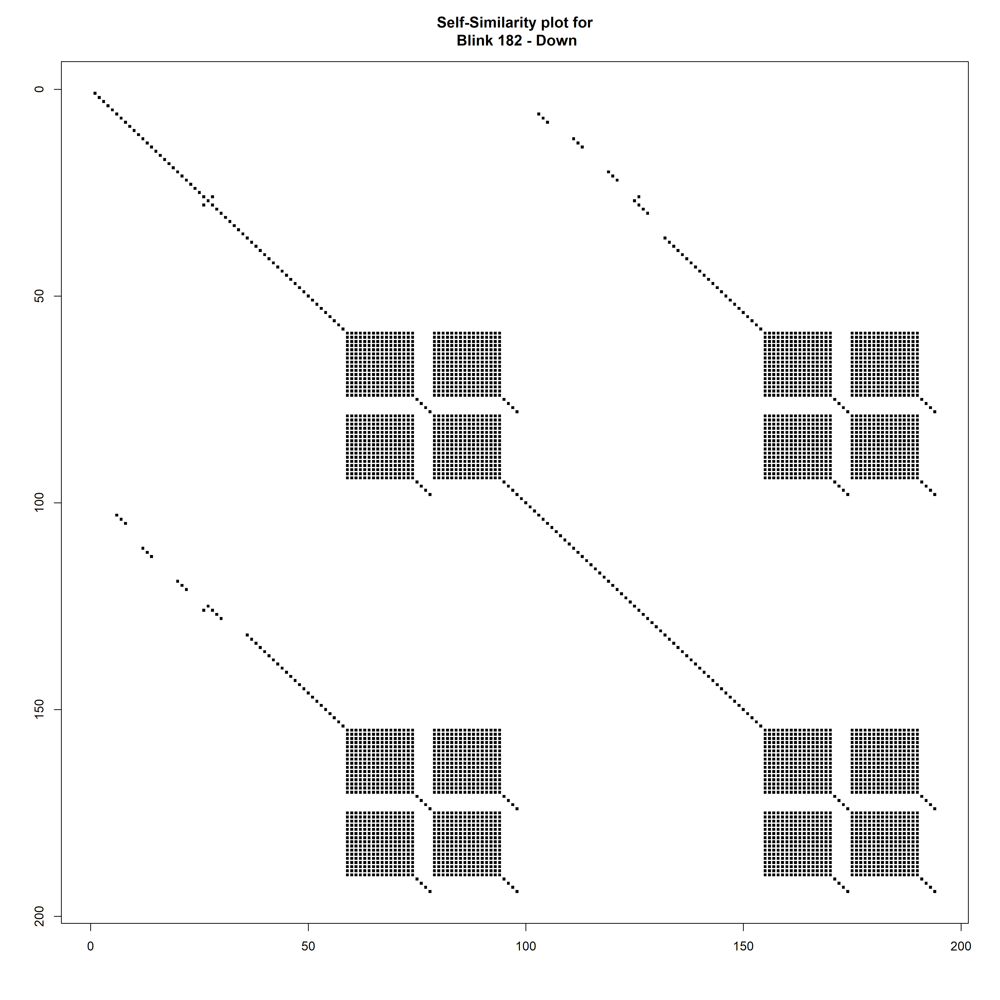

# Self-Similarity plots using song lyrics
This project creates self-similarity plots (also known as "recurrence plots") from song lyrics. The plots essentially show any time a word is repeated in the song. The plot has the lyrics of the song on the x- and y-axes and is filled-in if the two words are the same and blank if not. I recommend looking at the SongSim page above to get an idea of what the plots show. 

I'm using R to replicate Colin Morris' work at [SongSim](https://colinmorris.github.io/SongSim/#/about) which was featured on Vox's "Earworm" series, episode 5, titled: ["Why we really really really like repetition in music"](https://www.youtube.com/watch?v=HzzmqUoQobc).

See also [Foote (1999)](http://musicweb.ucsd.edu/~sdubnov/CATbox/Reader/p77-foote.pdf). This paper includes plots using audio recordings (the ones with analog data are particularly beautiful!) rather than lyrics. I've also put a pdf copy in the 'docs' folder.

Finally, because I took two years to post this publicly (lol), someone else has developed an alternative implementation in R using ggplot which can scrape AZlyrics.com for the lyrics (I might have to steal that part). You can find that post on [R-bloggers](https://www.r-bloggers.com/decode-lyrics-in-pop-music-visualise-prose-with-the-songsim-algorithm/).

## Before running the file

You'll need
1. R, with the "here" package installed
2. A text file containing the lyrics (*must have an empty line at start and end of the file*)

## To generate the plot
1. Open the R script, `01_self_sim_plot` and add the artist and song name, e.g., "Artist - Song"
2. Choose the appropriate text file with the lyrics you want to plot when prompted at the start of the R script. 
3. Run the rest of the script. The plot will be placed into the same directory as the R script. 

## For example, here is a self-similarity plot using Blink-182's "Down":
 - the plot starts in the top-left and moves diagonally to the bottom-right.

